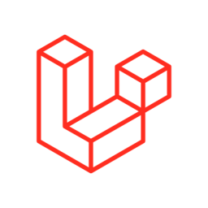
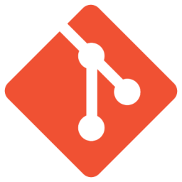

<picture>
  <source media="(prefers-color-scheme: dark)" srcset="https://raw.githubusercontent.com/dvsalmah/dvsalmah/output/pacman-contribution-graph-dark.svg">
  <source media="(prefers-color-scheme: light)" srcset="https://raw.githubusercontent.com/dvsalmah/dvsalmah/output/pacman-contribution-graph.svg">
  
</picture>

<h3><code>GET /v1/about</code></h3>

Hi, I'm <b>Dealova</b>. I build functional web applications, design clean interfaces, and solve complex problems with code.

<code></code> <code></code> <code></code> <code></code> <code></code> <code></code> <code></code> <code></code> <code></code>  
<code></code> <code></code> <code></code> <code></code> <code></code> <code></code> <code></code> <code></code> <code></code>

 

<h3><code>POST /v1/connect HTTP/1.1</code></h3>

<a href="https://dealovaa.space" target="_blank" rel="noreferrer"> <code>dealovaa.space</code>
</a>
<a href="https://www.linkedin.com/in/dealova-ns" target="_blank" rel="noreferrer">
<picture><source media="(prefers-color-scheme: dark)" srcset="https://raw.githubusercontent.com/danielcranney/readme-generator/main/public/icons/socials/linkedin.svg" />
</picture> <code>Dealova Nabila</code>
</a>
<a href="https://www.instagram.com/dnabs_" target="_blank" rel="noreferrer">
<code>dnabs_</code>
</a>
<a href="mailto:dealovasalmah12@gmail.com" target="_blank" rel="noreferrer"> <code>dealovasalmah12@gmail.com</code>
</a>

